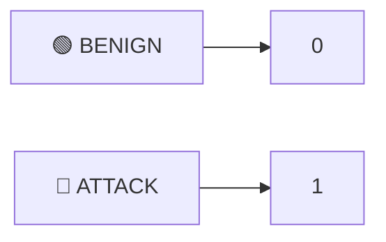
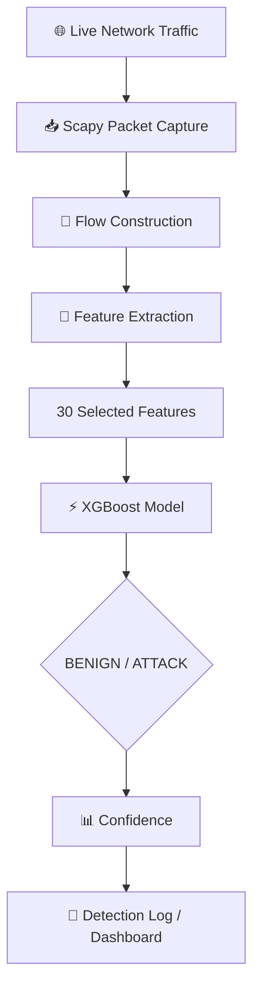
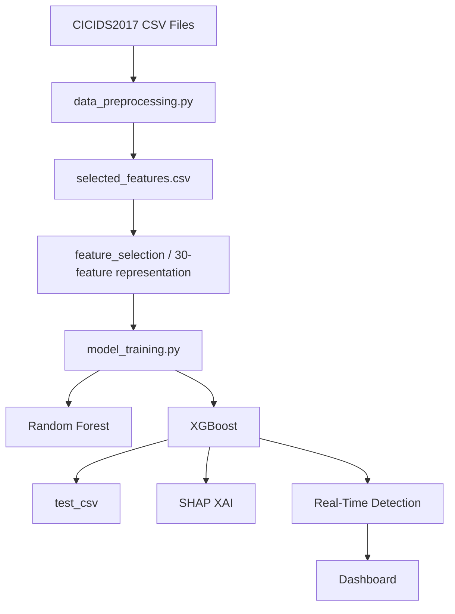
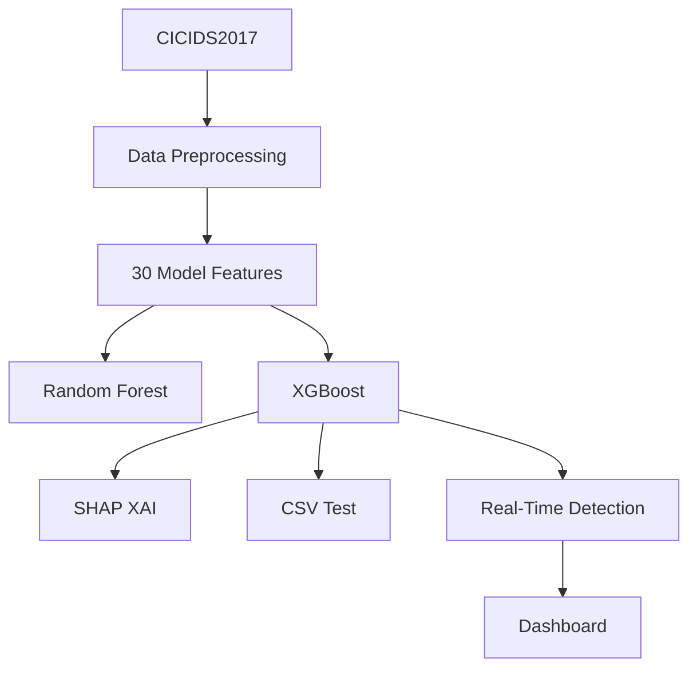
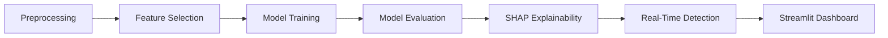

<div align="center">

# 🛡️ NIDS-ML — Project Summary


</div>

---

## 1. 📋 Project Overview

**NIDS-ML** is a machine-learning-based **Network Intrusion Detection System (NIDS)** built using the **CICIDS2017** dataset.

The current implementation provides:

| # | Capability |
|---|---|
| 1 | CICIDS2017 data preprocessing |
| 2 | Feature selection |
| 3 | Binary intrusion classification |
| 4 | Random Forest and XGBoost models |
| 5 | XGBoost-based SHAP explainability |
| 6 | CSV-based model evaluation |
| 7 | Real-time network traffic detection using Scapy |
| 8 | Streamlit dashboard for detection monitoring |
| 9 | Logging and prediction result storage |

**Classification task:**



---

## 2. 🗂️ Actual Project Structure

```
NIDS-Git-priyanshu/
└── NIDS-ML/
    │
    ├── data/
    │   ├── processed/
    │   │   ├── cleaned_data.csv
    │   │   └── selected_features.csv
    │   │
    │   ├── raw/
    │   │   ├── Friday-WorkingHours-Afternoon-DDos.pcap_ISCX.csv
    │   │   ├── Friday-WorkingHours-Afternoon-PortScan.pcap_ISCX.csv
    │   │   ├── Friday-WorkingHours-Morning.pcap_ISCX.csv
    │   │   ├── Monday-WorkingHours.pcap_ISCX.csv
    │   │   ├── Thursday-WorkingHours-Afternoon-Infilteration.pcap_ISCX.csv
    │   │   ├── Thursday-WorkingHours-Morning-WebAttacks.pcap_ISCX.csv
    │   │   ├── Tuesday-WorkingHours.pcap_ISCX.csv
    │   │   ├── Wednesday-workingHours.pcap_ISCX.csv
    │   │   ├── PREPROCESSING_GUIDE.md
    │   │   └── README.md
    │
    ├── logs/
    │   ├── explainability.log
    │   ├── feature_selection.log
    │   ├── model_training.log
    │   ├── preprocessing.log
    │   ├── realtime_detection.log
    │   └── README.md
    │
    ├── models/
    │   ├── best_model.pkl
    │   ├── best_model_metadata.txt
    │   ├── random_forest.pkl
    │   ├── xgboost.pkl
    │   ├── xgboost_shap_explainer.pkl
    │   ├── feature_names.pkl
    │   └── feature_names.txt
    │
    ├── results/
    │   └── prediction, evaluation and explainability outputs
    │
    ├── src/
    │   ├── __init__.py
    │   ├── config.py
    │   ├── dashboard.py
    │   ├── data_preprocessing.py
    │   ├── explainability_realtime.py
    │   ├── feature_selection.py
    │   ├── model_training.py
    │   ├── realtime_detection.py
    │   ├── shap_explainability.py
    │   ├── test_csv.py
    │   └── utils.py
    │
    ├── venv/
    │
    ├── .gitignore
    ├── ARCHITECTURE.md
    ├── PART2_COMPLETION.md
    ├── PART5_COMPLETION.md
    ├── PREPROCESSING_QUICKREF.md
    ├── PROJECT_SUMMARY.md
    ├── QUICKSTART.md
    ├── README.md
    ├── requirements.txt
    └── test_preprocessing.py
```

> ⚠️ The exact contents of `results/` may change as evaluation, SHAP analysis, and real-time detection are run.

---

## 3. 📊 Dataset

The project uses the **CICIDS2017** network intrusion dataset.

The current preprocessing pipeline discovered and processed **8 CSV files** from `data/raw/`.

### Dataset files

| # | File |
|---|---|
| 1 | Friday-WorkingHours-Afternoon-DDos.pcap_ISCX.csv |
| 2 | Friday-WorkingHours-Afternoon-PortScan.pcap_ISCX.csv |
| 3 | Friday-WorkingHours-Morning.pcap_ISCX.csv |
| 4 | Monday-WorkingHours.pcap_ISCX.csv |
| 5 | Thursday-WorkingHours-Afternoon-Infilteration.pcap_ISCX.csv |
| 6 | Thursday-WorkingHours-Morning-WebAttacks.pcap_ISCX.csv |
| 7 | Tuesday-WorkingHours.pcap_ISCX.csv |
| 8 | Wednesday-workingHours.pcap_ISCX.csv |

### ✅ Verified preprocessing statistics

| Metric | Value |
|---|---:|
| Combined rows | 2,830,743 |
| Original columns | 79 |
| Duplicate rows removed | 308,381 |
| Final rows | 2,522,362 |
| Final columns | 31 |
| Model features | 30 |
| Label | 1 |

The generated model-ready dataset is:

> 📁 `data/processed/selected_features.csv`

---

## 4. 🧹 Data Preprocessing

**File:** `src/data_preprocessing.py`

The preprocessing module:

- Discovers the CICIDS2017 CSV files
- Loads the datasets
- Combines the files
- Removes duplicate rows
- Selects the required 30 features
- Cleans the selected feature matrix
- Creates a binary label
- Saves the final model-ready dataset

### Final label distribution

| Class | Count |
|---|---:|
| 🟢 BENIGN | 2,096,484 |
| 🔴 ATTACK | 425,878 |

### Output

> 📁 `data/processed/selected_features.csv`

The verified output contained:

| | |
|---|---:|
| Rows | 2,522,362 |
| Columns | 31 |

---

## 5. 🧬 Selected Features

The models use the following **30 features**:

<table>
<tr>
<td>

1. Total_Backward_Packets
2. Total_Length_of_Bwd_Packets
3. Fwd_Packet_Length_Max
4. Fwd_Packet_Length_Std
5. Bwd_Packet_Length_Max
6. Bwd_Packet_Length_Min
7. Bwd_Packet_Length_Mean
8. Bwd_Packet_Length_Std
9. Flow_IAT_Std
10. Flow_IAT_Max

</td>
<td>

11. Flow_IAT_Min
12. Fwd_IAT_Mean
13. Fwd_IAT_Std
14. Fwd_IAT_Max
15. Fwd_IAT_Min
16. Bwd_IAT_Total
17. Max_Packet_Length
18. Packet_Length_Std
19. Packet_Length_Variance
20. PSH_Flag_Count

</td>
<td>

21. Average_Packet_Size
22. Avg_Bwd_Segment_Size
23. Subflow_Fwd_Bytes
24. Subflow_Bwd_Packets
25. Subflow_Bwd_Bytes
26. Init_Win_bytes_backward
27. Active_Mean
28. Active_Max
29. Active_Min
30. Idle_Max

</td>
</tr>
</table>

Feature metadata is stored in:

- 📁 `models/feature_names.pkl`
- 📁 `models/feature_names.txt`

> ℹ️ This metadata is used to keep the feature names and feature ordering consistent between training, evaluation, SHAP, and real-time detection.

---

## 6. 🎯 Feature Selection

**File:** `src/feature_selection.py`

This module belongs to the feature-selection stage of the project.

The current model pipeline ultimately uses the 30-feature set listed above.

> ⚠️ The project should not claim additional feature-selection algorithms unless they are actually present and used in the current implementation.

---

## 7. 🤖 Model Training

**File:** `src/model_training.py`

The current model-training implementation focuses on two machine-learning models:

| Model | Saved File |
|---|---|
| 🌲 Random Forest | `models/random_forest.pkl` |
| ⚡ XGBoost | `models/xgboost.pkl` |

Additional model-related files present in the project include:

- `models/best_model.pkl`
- `models/best_model_metadata.txt`

**Primary model** used in the verified real-time detection workflow:

> ⚡ **XGBoost** — loaded from `models/xgboost.pkl`

---

## 8. 🧪 Model Evaluation

**File:** `src/test_csv.py`

The project provides a CSV testing pipeline for evaluating the trained model on CICIDS2017 CSV files.

```bash
cd src

python test_csv.py --model xgboost --csv "..\data\raw\Friday-WorkingHours-Afternoon-DDos.pcap_ISCX.csv"

python test_csv.py --model xgboost --csv "..\data\raw\Friday-WorkingHours-Afternoon-PortScan.pcap_ISCX.csv"
```

The test script:

- Loads the selected model
- Loads the feature metadata
- Extracts the required 30 features
- Preserves the model's feature order
- Generates predictions
- Calculates classification metrics
- Generates a confusion matrix
- Saves prediction results

---

## 9. ✅ Verified XGBoost Evaluation Results

### 🔴 DDoS Dataset

**Dataset:** `Friday-WorkingHours-Afternoon-DDos.pcap_ISCX.csv`
**Rows:** 225,745

| Metric | Value |
|---|---:|
| Accuracy | **99.9189%** |
| Precision | **99.9531%** |
| Recall | **99.9039%** |
| F1-score | **99.9285%** |
| ROC-AUC | **99.9971%** |

**Confusion matrix:**

|                    | Predicted BENIGN | Predicted ATTACK |
|--------------------|------------------:|------------------:|
| **Actual BENIGN**  | 97,658            | 60                |
| **Actual ATTACK**  | 123               | 127,904           |

### 🟠 PortScan Dataset

**Dataset:** `Friday-WorkingHours-Afternoon-PortScan.pcap_ISCX.csv`
**Rows:** 286,467

| Metric | Value |
|---|---:|
| Accuracy | **99.9613%** |
| Precision | **99.9522%** |
| Recall | **99.9780%** |
| F1-score | **99.9651%** |
| ROC-AUC | **99.9978%** |

**Confusion matrix:**

|                    | Predicted BENIGN | Predicted ATTACK |
|--------------------|------------------:|------------------:|
| **Actual BENIGN**  | 127,461           | 76                |
| **Actual ATTACK**  | 35                | 158,895           |

> ⚠️ These results are evaluation results on CICIDS2017 data. They should not be presented as proof of equivalent real-world detection performance.

---

## 10. 🔍 SHAP Explainability

**File:** `src/shap_explainability.py`

The project uses **SHAP (SHapley Additive exPlanations)** to explain model predictions.

The primary explainability target is the **XGBoost** model.

**SHAP explainer:** `models/xgboost_shap_explainer.pkl`

### Explainability goals

SHAP is used to understand:

- Which features influence predictions
- How individual feature values contribute to a prediction
- Which features are globally important
- Why a particular flow was classified as BENIGN or ATTACK

### Supported explainability outputs

| | | |
|---|---|---|
| Summary plots | Bar plots | Waterfall plots |
| Force plots | Dependence analysis | Individual prediction explanations |
| Global feature importance | Top contributing features | |

> ⚠️ The project should only claim plots or outputs that have actually been generated and verified.

---

## 11. 📡 Real-Time Detection

**File:** `src/realtime_detection.py`

The real-time detector uses **Scapy** + **XGBoost** to process live network traffic.

### Pipeline



**Verified command:**

```bash
python realtime_detection.py
```

The detector successfully loaded `models/xgboost.pkl` and produced live predictions.

**Example verified output:**

```
BENIGN |
140.82.113.25:443 -> 172.20.33.1:61259 |
confidence=0.9999 |
packets=3
```

---

## 12. 🌐 Network Flow Information

The real-time detection output contains flow-level information such as:

| Field |
|---|
| Timestamp |
| Source IP |
| Source Port |
| Destination IP |
| Destination Port |
| Prediction |
| Confidence |
| Packet Count |

The dashboard has also been updated to display: **Source IP, Source Port, Destination IP, Destination Port** — along with prediction and confidence information.

A flow such as:

```
140.82.113.25:443  →  172.20.33.1:61259
```

is **not automatically incorrect**. It represents traffic travelling from the remote server's port 443 to a local ephemeral port.

---

## 13. 📈 Streamlit Dashboard

**File:** `src/dashboard.py`

The dashboard provides a visual interface for the NIDS.

The current dashboard displays real detection information including:

| | |
|---|---|
| Detection distribution | Recent detections |
| Timestamp | Prediction |
| Flow | Source IP |
| Source Port | Destination IP |
| Destination Port | Confidence |
| Packet count | |

It also identifies the current primary model: **XGBoost**

> ✅ The dashboard is connected to the real-time detection data rather than displaying only hard-coded example values.

---

## 14. 🧩 Explainability + Real-Time Module

**File:** `src/explainability_realtime.py`

This file exists in the project as a **combined** explainability/realtime module.

It should be treated **separately** from:

- `src/shap_explainability.py`
- `src/realtime_detection.py`

> ⚠️ The three files represent related functionality, but they are separate files in the actual repository. Do not describe the repository as having only one explainability/realtime file.

---

## 15. 📜 Logs

The project maintains separate log files:

| Log File | Purpose |
|---|---|
| `logs/preprocessing.log` | Dataset processing |
| `logs/feature_selection.log` | Feature selection |
| `logs/model_training.log` | Model training |
| `logs/explainability.log` | Explainability execution |
| `logs/realtime_detection.log` | Real-time detection |

---

## 16. 📦 Results

The project contains a `results/` directory for generated outputs.

Depending on which components have been executed, this directory can contain:

- Model prediction CSV files
- Evaluation results
- SHAP outputs
- Plots
- Other generated analysis files

> ℹ️ The exact contents can change during execution.

---

## 17. ⚙️ Configuration and Utilities

The source directory also contains:

- `src/config.py`
- `src/utils.py`

These provide supporting configuration and utility functionality used by the project.

---

## 18. 📚 Requirements

The project dependency file is: `requirements.txt`

The implementation uses libraries including:

        

> ℹ️ The exact installed versions should be taken from the project's current `requirements.txt`.

---

## 19. 🔄 End-to-End Workflow



---

## 20. 🗃️ Current Models

| Model | File | Purpose |
|---|---|---|
| 🌲 Random Forest | `models/random_forest.pkl` | ML model |
| ⚡ XGBoost | `models/xgboost.pkl` | **Primary model** |
| 🔍 XGBoost SHAP Explainer | `models/xgboost_shap_explainer.pkl` | Explainability |

**Additional files:**
- `best_model.pkl`
- `best_model_metadata.txt`

> ⚠️ These should be retained only if they are still used by the current project workflow.

---

## 21. ⚠️ Important Limitations

### Dataset limitation

The current model is trained/evaluated using CICIDS2017.

> **CICIDS2017 performance ≠ guaranteed real-world performance**

### Binary classification

The current prediction task is: **BENIGN / ATTACK**

> It should not be described as a verified multi-class attack-family classifier.

### Confidence

A confidence such as `0.9999` is the model's probability output.

> It does **not** guarantee that the prediction is objectively correct.

### Real-time detection

The real-time module demonstrates live packet capture and model inference.

> It does not prove detection of every possible network attack.

### Zero-day attacks

> The project does not claim guaranteed detection of previously unseen or zero-day attacks.

---

## 22. 🚫 What Is Not Part of the Current Core Pipeline

The earlier project documentation described several models and techniques that are **not** part of the current implemented core pipeline.

**Do not list these as current models unless they are actually restored and used:**

| | | |
|---|---|---|
| SVM | KNN | Logistic Regression |
| Naive Bayes | LSTM | CNN |
| CNN-LSTM | | |

**Similarly, do not claim the current pipeline uses:**

- NSL-KDD
- SMOTE preprocessing
- StandardScaler preprocessing
- Multiple deep-learning architectures

> unless those components are actually present in the current implementation.

---

## 23. 🎓 Academic Contribution

The implemented project demonstrates:

| Domain | Contribution |
|---|---|
| 🤖 Machine Learning | Random Forest, XGBoost |
| 🔍 Explainable AI | SHAP |
| 🌐 Network Security | CICIDS2017, Network-flow features, Scapy packet capture, Intrusion classification |
| 🚀 Deployment | Real-time detection, Streamlit dashboard |
| 📊 Evaluation | Accuracy, Precision, Recall, F1-score, ROC-AUC, Confusion Matrix |

---

## 24. ✅ Current Completion Status

### Data
- [x] CICIDS2017 CSV files loaded
- [x] Dataset combined
- [x] Duplicate rows removed
- [x] 30 features selected
- [x] Binary labels created
- [x] `selected_features.csv` generated

### Machine Learning
- [x] Random Forest model available
- [x] XGBoost model available
- [x] XGBoost tested on DDoS dataset
- [x] XGBoost tested on PortScan dataset

### Explainability
- [x] SHAP module available
- [x] XGBoost SHAP explainer available

### Real-Time Detection
- [x] Scapy capture
- [x] Flow processing
- [x] Feature extraction
- [x] XGBoost inference
- [x] BENIGN / ATTACK classification
- [x] Confidence calculation
- [x] Source IP display
- [x] Destination IP display
- [x] Port information
- [x] Packet count

### Dashboard
- [x] Streamlit dashboard
- [x] Detection distribution
- [x] Recent detections
- [x] Prediction
- [x] Flow
- [x] Source IP
- [x] Destination IP
- [x] Confidence
- [x] Packet count
- [x] Primary model display

---

## 25. 💻 Quick Commands

**Preprocess data**
```bash
cd src
python data_preprocessing.py
```

**Train models**
```bash
python model_training.py
```

**Test XGBoost on DDoS data**
```bash
python test_csv.py --model xgboost --csv "..\data\raw\Friday-WorkingHours-Afternoon-DDos.pcap_ISCX.csv"
```

**Test XGBoost on PortScan data**
```bash
python test_csv.py --model xgboost --csv "..\data\raw\Friday-WorkingHours-Afternoon-PortScan.pcap_ISCX.csv"
```

**Start real-time detection**
```bash
python realtime_detection.py
```

**Start dashboard**
```bash
streamlit run dashboard.py
```

---

## 26. 🏁 Final Project State



<div align="center">

| Property | Value |
|---|---|
| **Current primary model** | ⚡ XGBoost |
| **Current classification** | 🟢 BENIGN / 🔴 ATTACK |
| **Current dataset** | CICIDS2017 |
| **Current model input** | 30 network-flow features |

</div>

### Current system


